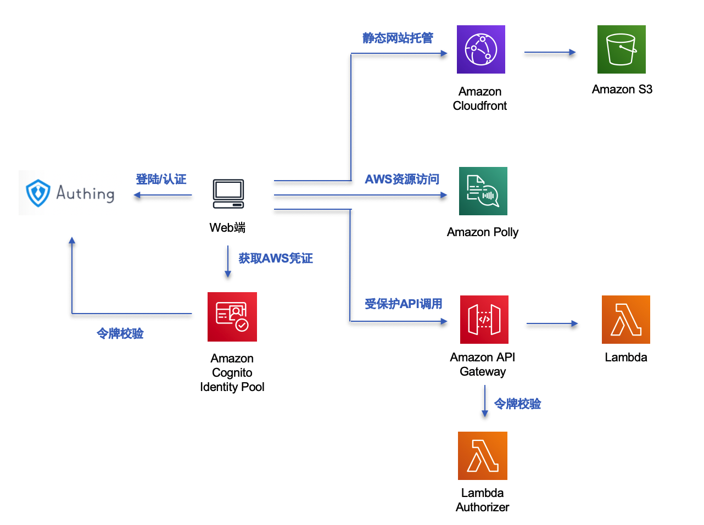
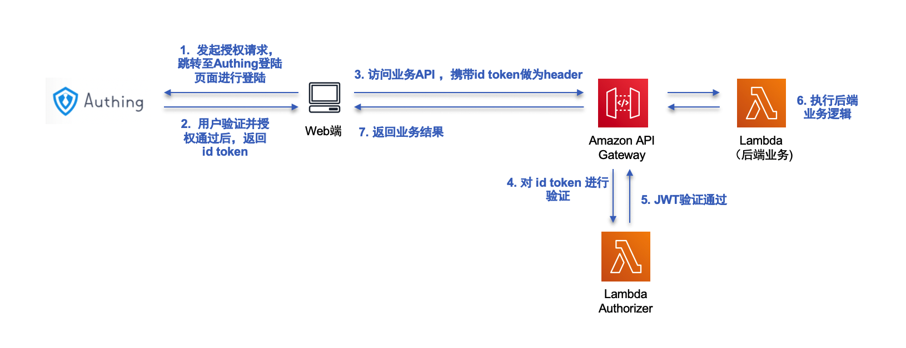
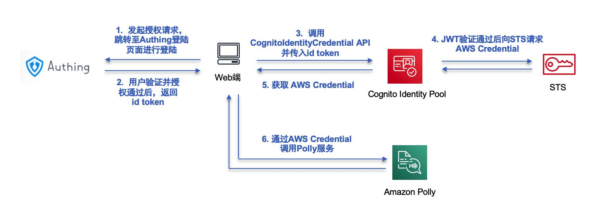
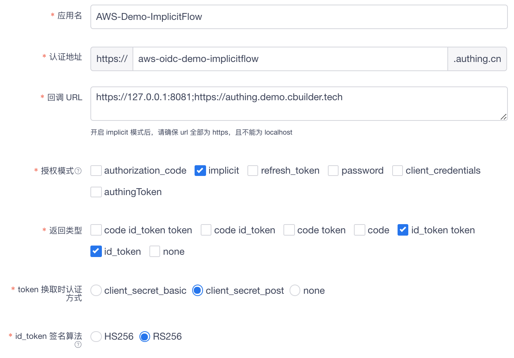
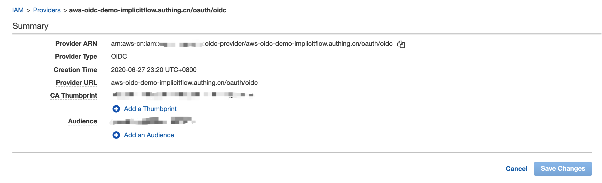
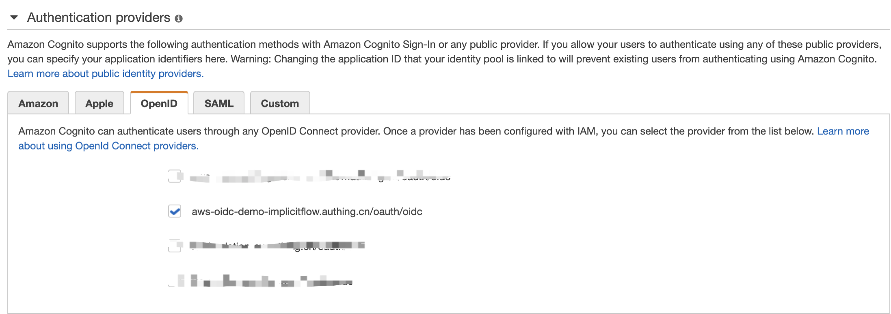

# AWS集成Authing认证服务的演示

这是一个简单的示例，演示如何在AWS国内区域集成Authing.cn的认证服务，用来做为AWS Cognito User Pool的替代方案。

## 基本介绍

AWS Cognito User Pool是AWS做为身份池的托管服务，在许多AWS Solutions或是用户创建的WEB/移动端应用都被广泛的使用。通过该服务可以快速建立一个身份池并与AWS的其他服务集成，并用来做身份认证和授权。一个常用的场景是API Gateway可以集成Cognito User Pool进行用户身份认证与授权，方便对API进行保护。另一个常用的场景是结合Cognito Identity Pool来在Web或移动端安全地获取AWS临时密钥，进而访问其他AWS服务。

目前Cognito User Pool服务在国内区域暂时未上线，这对将国外的AWS Solutions或用户应用迁移至国内区域部署造成困难。这个项目会演示如何通过集成第三方的认证服务(Authing.cn)，来替代Cognito User Pool的功能，并实现上述提到的两个常用的业务场景。

寻找Cognito User Pool的替代方案的基本思路，是找到一个基于 OpenID Connect 协议的认证服务，可以是第三方SaaS(如Authing, Auth0等)，或是自建(如基于开源的 Keycloark 软件)。Authing是AWS在国内的合作伙伴，因此在这个项目会演示如何使用Authing来做为Cognito User Pool的替代方案。

可以访问下面演示网站, 进行简单的用户注册后查看访问效果

https://authing.demo.cbuilder.tech/

## 整体架构

演示网站整体架构如下：
* 通过S3进行静态网站托管, 并利用Cloudfront进行静态内容加速和HTTPS证书挂载
* 通过Authing进行登陆认证，做为User Pool的替代方案
* 通过Authing认证后获取令牌：
* * 访问API Gateway提供的REST API
* * 通过Cognito Identity Pool获取临时AWS凭证，访问AWS资源（这里以Polly服务为例)





### 通过OIDC Implicit Flow获取id token：

关于结合Authing实现OIDC授权的相关细节，可以参考[Authing的文档](https://docs.authing.cn/authing/authentication/oidc/oidc-authorization) . 由于静态网站无法在客户端安全的存储Client Secret, 因此在这里采用Implicit Flow的方式来获取id token. 

关于OIDC获取token的几种方式及对比，可参考这个[文档](https://www.scottbrady91.com/OpenID-Connect/OpenID-Connect-Flows)

### 对Rest API的安全访问




### 通过Cognito Identity Pool获取AWS临时密钥，从而安全访问AWS资源(如本示例中的Polly服务)




## 部署

1. Authing配置：
需要先在Authing中创建OIDC应用，具体可以参考这篇[文章](https://juejin.im/post/5cc66c71e51d456e2e656de0)。这个演示环境使用的是 Implicit Flow，并使用RS256算法进行id token签名，可参考如下进行回调URL、授权模式、返回类型等设置：



2. 部署Lambda Authorizer及受保护的API

由于id token使用RS256算法进行加密，因此需要在Lambda Authorizer中设置相应密钥，以便进行token验证，具体可参见[lambda-authorizer/app.js](lambda-authorizer/app.js) 中相关的代码注释。

演示环境中API Gateway及相关Lambda已经描述在SAM模板( [/template.yaml](/template.yaml) )中，通过SAM可以直接进行自动部署：

```bash
$ sam build
$ sam deploy --guided
```
3. Authing 与 Cognito Identity Pool 的集成配置

3.1 在 IAM 中将 Authing 添加为 OIDC Provider, 其中 
- Provider URL : 即为 Authing 应用对应的 Issuer, 比如本示例使用的 issuer 为：https://aws-oidc-demo-implicitflow.authing.cn/oauth/oidc
- Audience: 即为 Authig应用对应的 App ID

创建成功后如下所示：



具体文档可参考： https://docs.aws.amazon.com/IAM/latest/UserGuide/id_roles_providers_create_oidc.html

3.2 配置 Cognito Identity Pool

创建 Cognito Identity Pool ，并指定 Authing 做为 Authenticated Provider :



同时，Cognito Identity Pool 会分别创建两个 IAM Role (针对认证用户和匿名用户)，需要对认证用户的 IAM Role 进行权限设定，示例网站使用了 Polly 服务，因此需要添加访问 Polly 的权限


4. 部署静态网站

前端演示页面( [frontend/](frontend/) )可以上传到S3桶，并开启S3静态网站托管功能，注意需要在前面增加Cloudfront并添加HTTPS证书; 或者可以选择部署在一台EC2上。

## 示例

目前基本这个方案已经将两个AWS Solutions进行改造并迁移至国内区域，具体可参考：

- [AWS Connected Vehicle Solution](https://github.com/linjungz/aws-connected-vehicle-solution)
- [AWS IoT Device Simulator](https://github.com/linjungz/iot-device-simulator-cn)